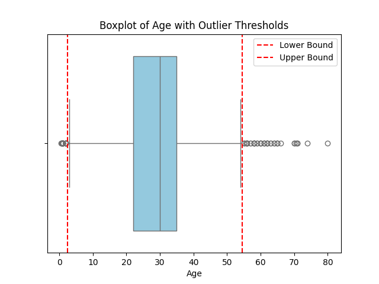

# 🚢 Titanic Survival Prediction

This project aims to predict whether Titanic passengers survived or not using machine learning techniques.

---

## 📂 Contents

- 🔍 Exploratory Data Analysis & Missing Value Handling
- ⚙️ Feature Engineering (gender, age, ticket class, etc.)
- 🤖 Model Training (Logistic Regression)
- 📊 Evaluation Metrics (Accuracy, Precision, Recall, F1, ROC AUC)
- 📉 ROC Curve & Confusion Matrix Visualization

---

## 🛠️ Tools & Libraries

- Python 3.x  
- pandas, numpy  
- matplotlib, seaborn  
- scikit-learn

---

## 🚀 Getting Started

1. Clone the repository:

   ```bash
   git clone https://github.com/codelones/titanic-survival-prediction.git
   cd titanic-survival-prediction
   ```

2. Install dependencies:

   ```bash
   pip install -r requirements.txt
   ```

3. Run the project in PyCharm or any Python IDE.

---

## 📎 Dataset Source

- [Kaggle Titanic Dataset](https://www.kaggle.com/c/titanic)

---

## 🙋 Personal Note

I am still in the learning phase and working on projects to apply what I learn in practice.  
I truly welcome any feedback, questions, or suggestions you may have — feel free to reach out!

## 📉 ROC Curve

This plot shows the performance of the logistic regression model in terms of True Positive Rate vs. False Positive Rate.


---

## 📊 Confusion Matrix

A visual representation of the model’s predictions compared to the actual outcomes.


## Threshold with Boxplot 



## Confusion Matrix 


